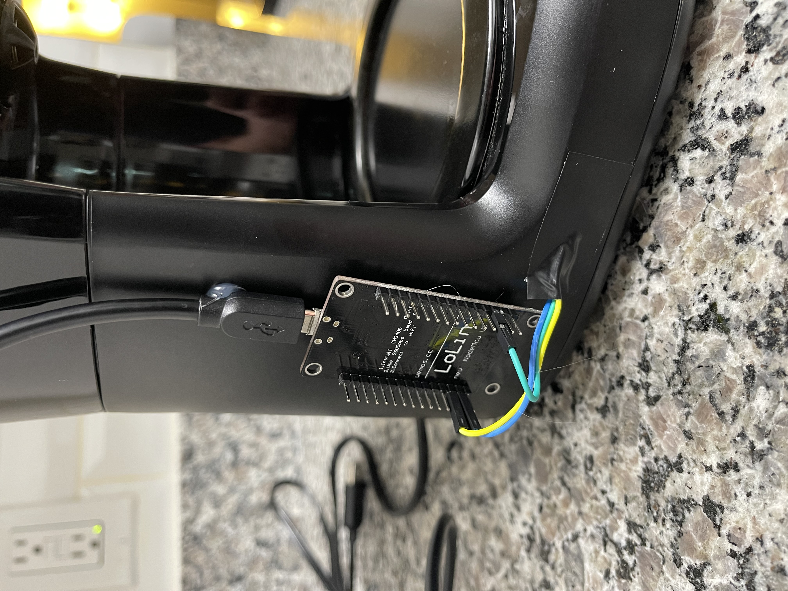

# ESP8266 Microservice Coffee Pot

## Description
This code is to be loaded onto any Arduino board which supports WiFi. This guide is written for my ESP8266 LiLon NodeMCU V3.



## Installation
1. Set and get your NodeMCU board going [here](https://www.instructables.com/Getting-Started-With-ESP8266LiLon-NodeMCU-V3Flashi/)

2. Install [Arduino IDE](https://www.arduino.cc/en/software) and open `ESP8266-Coffee-Pot.ino`

3. Install the board manager using this helpful [guide](https://arduino-esp8266.readthedocs.io/en/3.1.1/installing.html#boards-manager)
    * Hint: The url to add is `http://arduino.esp8266.com/stable/package_esp8266com_index.json`

4. Install [Arduino_JSON by Arduino](https://github.com/arduino-libraries/Arduino_JSON)
---
## Configuration
### WiFi - Required
The code needs to be configured to your WiFi network. 
[These lines](https://github.com/Aman7123/ESP8266-Coffee-Pot/blob/757ff3c42405b5e6583dc6497e3fa2715ad95372/ESP8266-Coffee-Pot.ino#L10-L11) need to contain your WiFi ssid and password.

*NOTE: The ESP8266 chip does not have WiFi 5Ghz capibilities.*

### Customizations - Optional
All additional configuration values are located in [definitions.h](https://github.com/Aman7123/ESP8266-Coffee-Pot/blob/main/src/definitions/definitions.h)

---
## Connecting to the board
If you start the board while wired into your Ardino IDE within the build and upload screen you will find the board MAC Adress which can be used to assign a static IP within your routers configurations.

If you check the serial output tab of the Arduino IDE the board will print it's MAC and IP address on startup, set the baud rate to `115200`.


---
## How To Brew Coffee
Brewing coffee is as simple as interacting with the embeded microservice how on your WiFi network.
This board comes equiped with these endpoints on the default configuration:
| Method | Endpoint | Decription |
| --- | --- | --- |
| GET | `/coffee` | Get information related to variables and coffee status |
| POST | `/coffee` | Set a new time and some other control values for brewing coffee |
| PATCH | `/coffee` | Update time and other variables |
| DELETE | `/coffee` | Cancels the coffee brewing |

The request body for the POST and PATCH methods is:
```json
{
  "hopperLoaded": true,
  "brewStart": 1673826720
}
```

The `brewStart` field is required on a POST and for convenience is increased by 24 hours after an initial brew starts. 
Even if the start time is set through a POST the `hopperLoaded` value is requred to be set either in the initial POST or a subsequent PATCH. 

---
## Credits
* Aaron Renner <http://github.com/Aman7123>