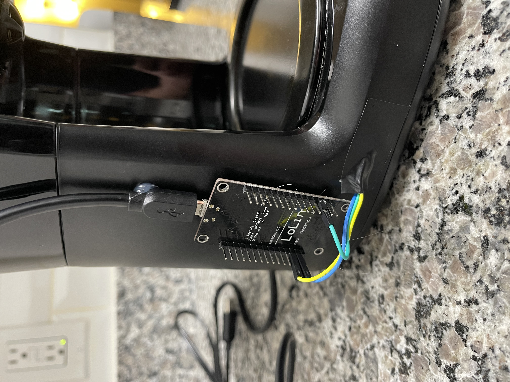
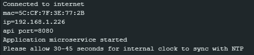

# ESP8266 Micro service Coffee Pot

## Description
This code is to be loaded onto any Arduino board which supports Wi-Fi. This guide is written for my ESP8266 LiLon Node MCU V3.

---
## Installation
1. Set and get your Node MCU board going [here](https://www.instructables.com/Getting-Started-With-ESP8266LiLon-NodeMCU-V3Flashi/)

2. Install [Arduino IDE](https://www.arduino.cc/en/software) and open `ESP8266-Coffee-Pot.ino`

3. Install the board manager using this helpful [guide](https://arduino-esp8266.readthedocs.io/en/3.1.1/installing.html#boards-manager)
   * Hint: The url to add is `http://arduino.esp8266.com/stable/package_esp8266com_index.json`

4. Install [Arduino_JSON by Arduino](https://github.com/arduino-libraries/Arduino_JSON)
---
## Configuration
### Wi-Fi - Required
The code needs to be configured to your Wi-Fi network. 
[secrets.h](https://github.com/Aman7123/ESP8266-Coffee-Pot/blob/65894b610bcbd67616558b80ade769d4996b349f/secrets.h#L1-L2) need to contain your Wi-Fi ssid and password.

*NOTE: The ESP8266 chip does not have Wi-Fi 5Ghz capabilities.*

### Customization - Optional
All additional configuration values are located in [definitions.h](https://github.com/Aman7123/ESP8266-Coffee-Pot/blob/main/src/definitions/definitions.h)

---
## Connecting to the board
If you start the board while wired into your Arduino IDE within the build and upload screen you will find the board MAC Address which can be used to assign a static IP within your routers configurations.

If you check the serial output tab of the Arduino IDE the board will print its MAC and IP address on startup, set the baud rate to `115200`.

---
## How To Brew Coffee
Brewing coffee is as simple as interacting with the embedded micro service how on your Wi-Fi network.
This board comes equipped with these endpoints on the default configuration:
| Method | Endpoint | Decription |
| --- | --- | --- |
| GET | `/coffee` | Get information related to variables and coffee status |
| POST | `/coffee` | Set a new time and some other control values for brewing coffee |
| PATCH | `/coffee` | Update time and other variables |
| DELETE | `/coffee` | Cancels the coffee brewing |

The request body for the POST and PATCH methods is:

*All vales optional*
| Request Body Option | Description |
|---------------------|-------------------------------------------------------------------------------------------------------------|
| reoccurringStart | Provide to set up a permanent consistent brew pattern, must load hopper by sending `hopperLoaded` to true |
| hopperLoaded | Used to inform the system that there is sufficient water and coffee grounds loaded |
| instantBrew | Can be used in combination with `hopperLoaded` to start an immediate brew |

Even if the start time is set, `hopperLoaded` is required to be set before time kicks off. 

The `reoccurringStart` value is increased for 24 hours in seconds as brewing starts for convince.

---
## Practical Implementation
Please see the `Coffee.shortcut` which can be imported into an iPhone or iPad for use with the Shortcuts app.
* [Shortcuts App Store Link](https://apps.apple.com/us/app/shortcuts/id915249334)

You can use this table below in combination with the data in a `GET` to build infinite apps.
| State | Description |
|-----------|----------------------------------------------------------------------------------|
| Waiting | This state occurs on the boards first boot |
| Pending | Once any successful POST or PATCH this state, coffee pot is holding instruction |
| Brewing | While the relay is triggered allowing electricity into the coffee pot circuits |
| Cancelled | After a DELETE request, a POST or PATCH will overwrite this |

---
## Credits
* Aaron Renner <http://github.com/Aman7123>